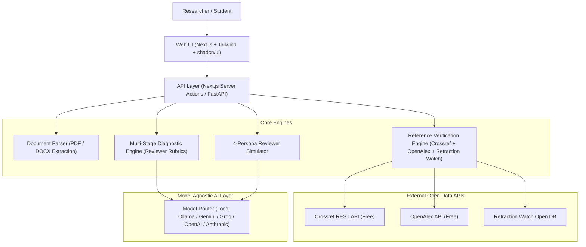

# ManuView 🔬📄

> **Open-Source AI Pre-Submission Manuscript Review & Scientific Diagnostic Suite**  
> *Because scientific feedback and education should be free, accessible, and transparent for every researcher worldwide.*

---

## 🌟 Mission

Commercial pre-submission review and academic consulting platforms charge researchers **\$39 to \$1,800+ per paper** simply to catch the obvious structural, methodological, and citation issues that trigger journal desk rejections.

**ManuView** is an open-source, community-driven platform built to democratize pre-submission peer-review diagnostics. It provides the same reviewer-calibrated rigor for free, with zero paywalls, complete transparency, and local-first privacy.

---

## 🎯 What ManuView Does (And What It Doesn't)

| Feature | Sentence-Level Grammar Tools (Grammarly, Paperpal) | Generic LLMs (ChatGPT, Claude) | **ManuView (Open Source)** |
| :--- | :--- | :--- | :--- |
| **Diagnostic Focus** | Commas, typos, passive voice | Conversational text summaries | **Structural, scientific, & methodological soundness** |
| **Reviewer Posture** | Mechanical spelling fixes | Agreeable / flattering bias | **Calibrated editorial & peer-reviewer scrutiny** |
| **Failure Detection** | Punctuation | Surface-level prose commentary | **Causal overclaims, missing controls, statistical power gaps, desk-reject risks** |
| **Citations** | Style format check only | Frequently hallucinates papers | **Real-time verification against Crossref, OpenAlex, & Retraction Watch** |
| **Simulated Personas**| None | Single-prompt chat | **Multi-stage 4-Persona Reviewer Simulation** |
| **Data Privacy** | Cloud servers | Cloud / training retention | **Local-first (run via Ollama/vLLM) or private API keys** |

---

## 🚀 Key Modules & Capabilities

### 1. The Pre-Submission Diagnostic Engine
- **The 6 Scoring Dimensions (1–5 scale)**:
  1. **Originality**: Checks stated contributions against current literature; flags incremental-only or derivative claims.
  2. **Importance & Broad Interest**: Evaluates whether the narrative connects to field-level questions rather than niche technicalities.
  3. **Strength of Claims vs. Evidence**: Detects causal overclaims (e.g. correlational observations phrased as causal mechanisms; claiming *"demonstrates"* without requisite controls).
  4. **Methodological Soundness**: Verifies sample size power, blinding, randomization, negative/positive controls, and figure-data consistency.
  5. **Clarity & Presentation**: Evaluates abstract structure (`Problem → Gap → Approach → Finding → Impact`) and logical flow.
  6. **Prior Work & Reference Integrity**: Flags outdated citations, high self-citation ratios (>25%), and missing landmark papers.
- **Prioritized Action Plan**:
  - 🚨 **Priority A (Must-Fix)**: Flaws that will trigger immediate editorial desk rejections.
  - ⚠️ **Priority B (Should-Fix)**: Major technical challenges peer reviewers will raise.
  - 💡 **Priority C (Worth-Improving)**: Presentation and contextual enhancements.

### 2. The 4-Persona Reviewer Simulator
- **Methods Reviewer**: Scrutinizes protocols, sample sizes, experimental controls, reagents, and code/data reproducibility.
- **Domain Expert**: Assesses novelty, relevance to the field, benchmark comparisons, and biological/theoretical significance.
- **Journal Editor**: Evaluates scope alignment, target readership interest, and desk-rejection hazards.
- **Statistician**: Audits distribution assumptions, multiplicity corrections, p-hacking risks, and error bar definitions.

### 3. Citation & Reference Integrity Scanner
- **Hallucinated Reference Detection**: Resolves DOIs in real-time against **Crossref** and **OpenAlex** to catch hallucinated AI citations.
- **Retraction Watch Integration**: Flags any references that have been retracted, expressed with concern, or corrected.
- **Citation Claim Checker**: Compares an in-text assertion against the cited paper's abstract to confirm if the claim is *Supported*, *Partially Supported*, or *Unsupported*.

### 4. Modular Researcher Submission Tools
1. **Journal Fit Predictor**: Analyzes title + abstract against an open corpus of 1,300+ journals to rank reach, realistic, and fallback venues.
2. **PRISMA 2020 Flow Diagram Generator**: Interactive, client-side tool for systematic review counts that reconciles arithmetic and exports editable SVGs.
3. **Journal Cover Letter Generator**: Generates concise, editor-calibrated cover letters highlighting key discoveries and fit.
4. **Graphical Abstract Checker**: In-browser checker validating image dimensions, DPI, color space, and readability against target journal guidelines.
5. **Submission Declaration Builder**: Step-by-step generator for Data Availability, Competing Interests, CRediT Author Contributions, and Ethics statements.
6. **Response to Reviewers Workspace**: Converts decision letters into structured, point-by-point rebuttal matrices and revision checklists.

---

## 🔒 Privacy & Data Safety

Unpublished research is sensitive intellectual property. ManuView is designed with strict privacy principles:
- **Local-First Support**: Run the entire review pipeline on your local machine using open-source models (Llama 3, DeepSeek, Mistral) via **Ollama** or **vLLM**.
- **Zero Data Training**: When using remote API providers (Gemini, Anthropic, Groq, OpenAI), zero data is ever retained or used for model training.
- **Ephemeral Processing**: Ingested manuscripts are held only in memory during analysis and never persisted to external databases.

---

## 🛠️ Architecture & Tech Stack

- **Frontend**: Next.js 14/15 (App Router), React, TypeScript, Tailwind CSS, Lucide Icons.
- **Document Ingestion**: `pdfplumber`, `PyMuPDF`, `mammoth.js`, `pdf-parse`.
- **Bibliographic Verification**: Crossref REST API, OpenAlex REST API, Retraction Watch database.
- **LLM Engine**: Multi-provider support (Ollama for 100% offline local privacy, or API keys for cloud providers).

---

## 📋 Roadmap

- [x] Initial repository structure & architecture blueprint
- [ ] Manuscript Ingestion Engine (PDF & DOCX section extractor)
- [ ] Reference Integrity & Retraction Verification Engine
- [ ] 6-Dimension Diagnostic Scoring Engine
- [ ] 4-Persona Reviewer Simulator
- [ ] Standalone Submission Tools (Journal Fit, PRISMA, Cover Letter, Rebuttal Builder)
- [ ] Report Export (.docx, .pdf, and interactive web report)
- [ ] One-click Docker setup for 100% offline local deployment

---

## 🤝 Contributing

Contributions from researchers, software engineers, editors, and peer reviewers are warmly welcomed!
Please read our [Contributing Guide](CONTRIBUTING.md) to get started.

---

## 📜 License

This project is licensed under the **MIT License** - see the [LICENSE](LICENSE) file for details.
